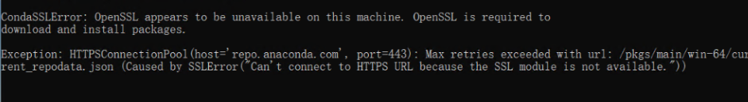
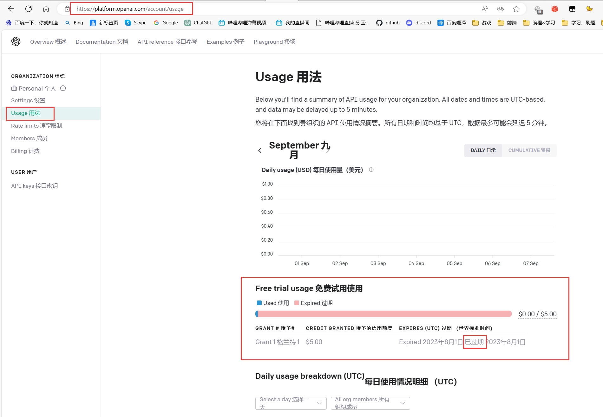

## 常见问题


- CondaSSLError: OpenSSL appears to be unavailable on this machine

    本地已经有 `Anaconda` 环境，在执行 半自动包的`1.创建虚拟环境.bat`时，出现报错 `CondaSSLError: OpenSSL appears to be unavailable on this machine`

    

    解决方案：参考 [blog.csdn.net/mynameisyaxuan/article/details/128323026](//blog.csdn.net/mynameisyaxuan/article/details/128323026)  

- ModuleNotFoundError: No module named 'xxx' 大同小异

    都是依赖库缺失问题，可以打开`requirements_bilibili.txt`/`requirements_dy.txt`/`requirements_ks.txt`内查看需要安装的依赖（可能还是遗漏...）  

    视情况更换镜像源，国内推荐清华源，如果清华源没有缺失的库，可以走pypi的源，安装命令如：
    
    `pip install PyQt5 -i https://pypi.tuna.tsinghua.edu.cn/simple`  

    注意：请在虚拟环境中安装！！！（如果你是根据半自动整合包做的话，先激活虚拟环境`conda activate ai_vtb`，然后进行安装）  

    ```shell
    https://pypi.org/simple
    https://pypi.python.org/simple/
    https://pypi.tuna.tsinghua.edu.cn/simple
    ```

- ModuleNotFoundError: No module named 'PyQt5'

    半自动包 运行 `GUI运行.bat` 时，出现

    ```shell
    Traceback (most recent call last):
    File "F:\github_pro\AI-Vtuber\main.py", line 10, in <module>
        from PyQt5.QtWidgets import QApplication, QMainWindow, QMessageBox, QLabel, QComboBox, QLineEdit, QTextEdit, QDialog
    ModuleNotFoundError: No module named 'PyQt5'
    ```

    解决方案：手动补装 `PyQt5` ，需要注意，得在 `ai_vtb` 的虚拟环境中安装

    可以发现最左侧有这个括号，表示你激活了 `ai_vtb` 的虚拟环境中，然后你在运行 后面的pip安装 `(ai_vtb) F:\github_pro\AI-Vtuber>pip install PyQt5`

    

- ModuleNotFoundError: No module named 'langid'

    半自动包 运行 `GUI运行.bat` 时，出现

    ```shell
    Traceback (most recent call last):
    File "F:\github_pro\AI-Vtuber\main.py", line 20, in <module>
        from utils.common import Common
    File "F:\github_pro\AI-Vtuber\utils\common.py", line 8, in <module>
        import langid
    ModuleNotFoundError: No module named 'langid'
    ```

    解决方案：手动补装 `langid` ，需要注意，得在 `ai_vtb` 的虚拟环境中安装， `pip install langid`

    

    如果遇到上图安装失败的问题 ， 走官方源下载 `pip install langid -i https://pypi.python.org/simple/`

    

- ModuleNotFoundError: No module named 'profanity'

    半自动包 运行 `GUI运行.bat` 时，出现  

    ```shell
    Traceback (most recent call last):
    File "F:\github_pro\AI-Vtuber\main.py", line 20, in <module>
        from utils.common import Common
    File "F:\github_pro\AI-Vtuber\utils\common.py", line 10, in <module>
        from profanity import profanity
    ModuleNotFoundError: No module named 'profanity'
    ```

    解决方案：手动补装 `profanity` ，需要注意，得在 `ai_vtb` 的虚拟环境中安装， `pip install profanity`

    

- ModuleNotFoundError: No module named 'ahocorasick'

    半自动包 运行`3.GUI运行.bat`时，出现  

    ```shell
    Traceback (most recent call last):
    File "F:\github_pro\AI-Vtuber\main.py", line 20, in <module>
        from utils.common import Common
    File "F:\github_pro\AI-Vtuber\utils\common.py", line 11, in <module>
        import ahocorasick
    ModuleNotFoundError: No module named 'ahocorasick'
    ```

    解决方案：手动补装 `pyahocorasick` ，需要注意，得在 `ai_vtb` 的虚拟环境中安装， `pip install pyahocorasick`

    

??? note "使用过程问题"

- 启动 webui 时报错:  No module named 'g4f'

    未安装 g4f，手动安装一下

    ```shell
    pip install g4f
    ```

    诸如此类依赖的报错需要在启动的时候注意，全部解决掉，否则即便 webui 正常打开了， web 服务依然是启动失败的，运行某些功能的时候会报错: HTTPConnectionPool(host='127.0.0.1', port=8082)

- openai 接口报错:《empty message》

    可能是API KEY过期了/额度没了，请检查API KEY是否可用。  

    在线测试参考：  

    [ChatGPT-Html](//ikaros521.eu.org/chatgpt-html)  

    [ChatGPT-Next-Web](//chat-gpt-next-web-ikaros-521.vercel.app)  

- ERROR: Cannot install -r requirements_bilibili.txt (line 23), aiohttp and langchain==0.0.142 because these package versions have conflicting dependencies.

    依赖冲突问题。可以删除 `requirements_bilibili.txt` 中的 `langchain==0.0.142` 和 `bilibili-api-python==9.1.0` ，然后进行重新安装。安装完成后，手动安装这2个库（按顺序安装）。  

    ```shell
    Miniconda3\python.exe -m pip install bilibili-api-python==9.1.0
    Miniconda3\python.exe -m pip install langchain==0.0.142
    ```

- ERROR: Conmunicate.`__init__`() got an unexpected keyword argument 'text'

    问题根因：Edge-TTS版本过低

    解决方案：升级到指定版本 `pip install edge-tts==6.1.6`


- File ".\flask_api_full_song.py", line 38, in wav2wav  out_audio, out_sr = svc_model.infer(spk, tran, raw_path) ValueError: too many values to unpack (expected 2)
    注意！！！如果你是 `4.1` 版本的整合包，很可能就有这个bug，需要修改 `flask_api_full_song.py` 的38行左右：  
    改  

    ```shell
    out_audio, out_sr = svc_model.infer(spk, tran, raw_path)
    ```

    为

    ```shell
    out_audio, out_sr, n_frames = svc_model.infer(spk, tran, raw_path)
    ```

- RuntimeWarning: Couldn't find ffmpeg or avconv - defaulting to ffmpeg, but may not work warn("Couldn't find ffmpeg or avconv - defaulting to ffmpeg, but may not work", RuntimeWarning)

    问题：pydub依赖ffmpeg，但环境不存在ffmpeg  

    解决方案：安装ffmpeg并配置环境变量  

    ffmpeg安装教程：[ffmpeg安装教程](//blog.csdn.net/HYEHYEHYE/article/details/122000352)  

    ffmpeg官方下载：[ffmpeg.org/download.html](//ffmpeg.org/download.html)  

    ffmpeg本仓库内下载：[releases](//github.com/Ikaros-521/AI-Vtuber/releases/tag/v0.13.0)  

    简述就是下载，解压，配置 ffmpeg 的 bin 到系统环境变量path中，完事。  

- qt.qpa.plugin: Could not find the Qt platform plugin "windows" in "" This application failed to start because no Qt platform plugin could be initialized.    Reinstalling the application may fix this problem.

    问题：无法找到Qt。

    解决方案：如果你是整合包，那请检查是否在 `中文路径` 下！！！如果是自行安装的，可以尝试重装pyqt5。

- 保存配置后没有自动重启，报错 [Errno 2] No such file or directory

    现象：  

    ```shell
    2023-08-03 17:27:24,700 - D:\GitHub_pro\AI-Vtuber-20230 729\main.py[line:1386] - INFO: 配置数据已成功写入文件！程序将在3秒后重启~
    D:\GitHub_pro\AI-Vtuber-20230: can't open file 'D:\\GitHub_pro\\AI-Vtuber-20230 729\\729\\Miniconda3\\python.exe': [Errno 2] No such file or directory
    ```

    问题：没有自动重启程序，并报错

    解决方案：请将项目放在 `非中文，无空格` 的路径下。  

    `D:\\GitHub_pro\\AI-Vtuber-20230 729` ——> `D:\\GitHub_pro\\AI-Vtuber-20230729`

- 更新后报错 ImportError: cannot import name 'sync' from 'bilibili_api'

    完整报错：

    ```shell
    File "D:\GitHub_pro\AI-Vtuber-20230815\bilibili.py", line 9, in <module>
        from bilibili_api import live, sync
    ImportError: cannot import name 'sync' from 'bilibili_api' (D:\GitHub_pro\AI-Vtuber-20230815\Miniconda3\lib\site-packages\bilibili_api\__init__.py)
    ```

    问题根因：`bilibili_api`没有`sync`模块，其实是更新后，`bilibili_api`不对了，需要重新安装对应依赖。  

    解决方案：

    1.删除 `bilibili-api-python` 和 `bilibili-api` ，参考命令（整合包）： `Miniconda3\python.exe -m pip uninstall bilibili-api-python bilibili-api`，然后在提示出入（y/n）部分输入 `y` ，然后回车，共2次。  

    ```shell
    Proceed (Y/n)? y
    Successfully uninstalled bilibili-api-python-15.5.3
    Proceed (Y/n)? y
    Successfully uninstalled bilibili-api-4.1.0
    ```  

    2.重新安装，可以手动安装 `Miniconda3\python.exe -m pip install bilibili-api-python bilibili-api` ，也可以直接执行`2-2.安装依赖.bat`完成安装。 

- 使用ChatGPT API，报错：error_message='You exceeded your current quota, please check your plan and billing details.'

    可能是API KEY过期了/额度没了，请检查API KEY是否可用。  

    

    在线测试参考：  
    [ChatGPT-Html](//ikaros521.eu.org/chatgpt-html/)  
    [ChatGPT-Next-Web](//chat-gpt-next-web-ikaros-521.vercel.app/)  

- Miniconda3\Scripts\playwright.exe install Fatal error in launcher: Unable to create process using  '"D:\GitHub_pro\AI-Vtuber-20230729\Miniconda3\python.exe"  "D:\ai3\AI-Vtuber-20230825\Miniconda3\Scripts\playwright.exe" install': ???????????

    playwright安装浏览器内核失败。   

    解决方案：重新安装playwright，需要注意，前提是激活了本地环境  

    ```shell
    pip uninstall playwright
    pip install playwright
    playwright install
    ```

- ModuleNotFoundError: No module named 'blivedm.models.web'; 'blivedm.models' is not a package

    解决方案：[AI-Vtuber/issues/381#issuecomment-1774128497](//github.com/Ikaros-521/AI-Vtuber/issues/381#issuecomment-1774128497)

- note "如何 不使用audio player，指定ai vtb的音频输出到指定声卡/扬声器？"

    在线图文教程：[issues/1018 :octicons-link-16:](https://github.com/Ikaros-521/AI-Vtuber/issues/1018)  

    

