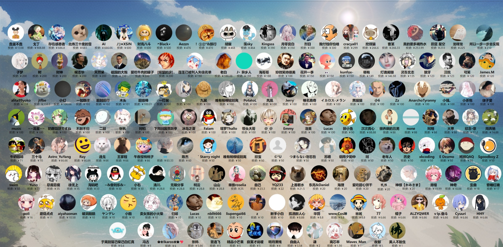

---
hide:
  - navigation
---

# ✨ Luna AI ✨

!!! tip "数据"

    
    
    
    
    

!!! example inline end "广告"

    如需付费调试，请联系Q `327209194`

    交流Q群 `587663288`

    AIHubMix: [aihubmix.com](https://aihubmix.com/register?aff=1BMI) —— OpenAI,Google,通义千问等大语言模型API代理站  

    ​迅雷加速器：[jsq.xunlei.com](https://jsq.xunlei.com/) 新用户可以凭口令领取7x24小时的免费福利加速。兑换码 口令：ikaros  

    更多广告招租（...）

!!! quote "介绍"

    `Luna AI` 是一款结合了最先进技术的虚拟AI主播。它整合了很多高效的人工智能模型和平台，包括 `ChatterBot、ChatGPT、Claude、langchain、chatglm、text-generation-webui、讯飞星火、智谱AI、谷歌Bard、通义星尘、阿里云百炼（通义千问、百川、月之暗面、零一万物、MiniMax）、千帆大模型（文心一言）、Gemini、Kimi Chat、QAnything、koboldcpp、FastGPT、Ollama、One-API、AnythingLLM、LLM_TPU、Dify、火山引擎（豆包）`。通过 Luna AI, 我们既可以在本地运行本地模型，也可以通过云端服务使用开放式 AI 平台的功能。当然，为了让对话照进现实，Luna AI 还结合了多模态模型，包括 `Gemini、glm-4v、Blip` 的图像识别能力，获取电脑画面进行分析讲解。 

    `Luna AI` 的外观由 `Live2D、Vtube Studio、xuniren、UE5 结合 Audio2Face、EasyAIVtuber、数字人视频播放器（Easy-Wav2Lip、Sadtalker、GeneFace++、MuseTalk、本地视频）、metahuman-stream（ernerf、musetalk、wav2lip）、DH_live、live2d-TTS-LLM-GPT-SoVITS-Vtuber` 技术打造，为用户提供了一个生动、互动的虚拟形象。这使得 `Luna AI` 能够在各大直播平台，如 `Bilibili、抖音、快手、微信视频号、拼多多、1688、斗鱼、让弹幕飞、YouTube、Twitch 和 TikTok`，进行实时互动直播。当然，它也可以在本地环境中与您进行个性化对话。

    为了使交流更加自然，`Luna AI` 使用了先进的自然语言处理技术和文本转语音技术，如 `Edge-TTS、VITS-Fast、elevenlabs、bark-gui、VALL-E-X、OpenVoice、GPT_SoVITS、clone-voice、Azure TTS、fish-speech、ChatTTS、CosyVoice、F5-TTS`。这些技术能够生成流畅的回答，而且 Luna AI 还可以通过 `so-vits-svc 和 DDSP-SVC` 实现声音的变化，以适应不同的场景和角色。

    此外，`Luna AI` 还能够通过特定指令与 `Stable Diffusion` 协作，展示画作。用户还可以自定义文案，让 Luna AI 循环播放，以满足不同场合的需求。

!!! warning "License"

    这个项目采用 GNU通用公共许可证（GPL） 进行许可。有关详细信息，请参阅 LICENSE 文件。  

    This project is licensed under the `GNU General Public License (GPL)`. Please see the `LICENSE` file for more details.  

!!! danger "注意"

    严禁将此项目用于一切违反《中华人民共和国宪法》，《中华人民共和国刑法》，《中华人民共和国治安管理处罚法》和《中华人民共和国民法典》之用途。  
    
    严禁用于任何政治相关用途。

!!! note "导航"

    <a href="//space.bilibili.com/3709626/channel/collectiondetail?sid=1422512" target="_blank">:fontawesome-solid-video: 视频教程合集</a>
     | 
    <a href="/">:material-file-document: 在线文档</a>
     | 
    <a href="//github.com/Ikaros-521/AI-Vtuber" target="_blank">:simple-github: GitHub</a>
     | 
    <a href="//gitee.com/ikaros-521/AI-Vtuber" target="_blank">:simple-gitee: Gitee</a>
     | 
    <a href="//github.com/Ikaros-521/LX_AI" target="_blank">:fontawesome-solid-video: 商用版-洛曦AI</a>

## :material-file-tree: 项目结构

!!! abstract "项目结构"

    - `config.json` 配置文件
    - `main.py` GUI主程序。会根据配置调用各平台程序
    - `utils` 文件夹，存储聊天、音频、通用类相关功能的封装实现
    - `data` 文件夹，存储数据文件、违禁词、文案等
    - `log` 文件夹，存储运行日志、字幕日志等
    - `out` 文件夹，存储TTS、SVC输出的音频文件，文案输出的音频文件
    - `Live2D` 文件夹，存储Live2D源码及模型
    - `song` 文件夹，存储点歌模式的歌曲
    - `docs` 文件夹，存储项目相关文档
    - `tests` 文件夹，存储单一功能点的测试程序
    - `cookie` 文件夹，存储部分功能需要用到的cookie数据

## :material-image: 效果图

!!! note "WebUI 界面"

    

!!! note "SD 接入"

    

## :material-more: 应用实例

### PK、连麦玩法如何配置？

参考配置：[https://github.com/Ikaros-521/AI-Vtuber/issues/579](https://github.com/Ikaros-521/AI-Vtuber/issues/579)  

## ⭐️Star 经历

## 🤝贡献

### 🎉鸣谢

感谢以下开发者对该项目做出的贡献：

### 💸投资方

### 合作伙伴

AIHubMix: [aihubmix.com](https://aihubmix.com/register?aff=1BMI)  ———— OpenAI,Google,通义千问等大语言模型API代理站  

​迅雷加速器：[jsq.xunlei.com](https://jsq.xunlei.com/) 新用户可以凭口令领取7x24小时的免费福利加速。兑换码 口令：ikaros  

优云智算： [compshare.cn](https://passport.compshare.cn/register?referral_code=CpxneZgXby6EOmUwLGr7hQ) GPU云算力服务器平台  

### 🙌赞助

{ width="400" }

## 黑名单

| 用户信息 | 名人名言 |
|--------|------|
| QQ：750359376 | 笑死，连点开源精神都没有 |
| QQ：378198682 | 【散播谣言】 |
| QQ：1939834860 | 【广告哥】 |
| QQ：1687246688 | 【白嫖还嘴臭】 |

